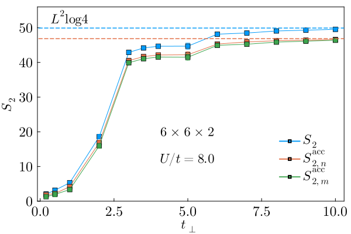
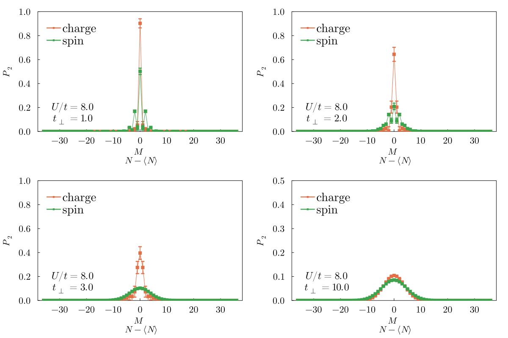
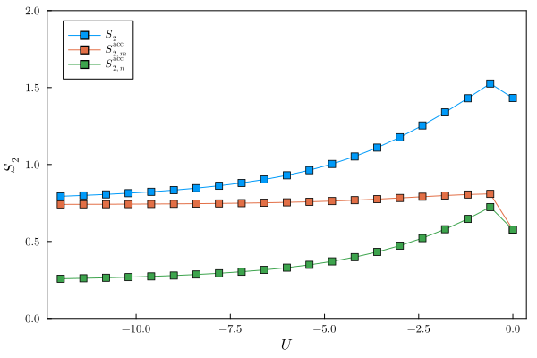
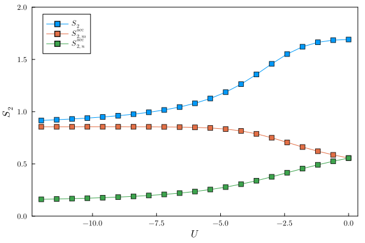
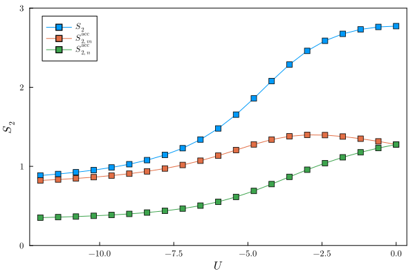
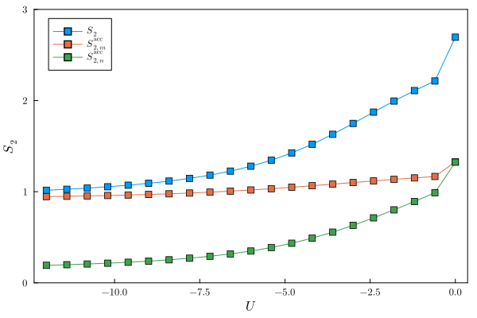
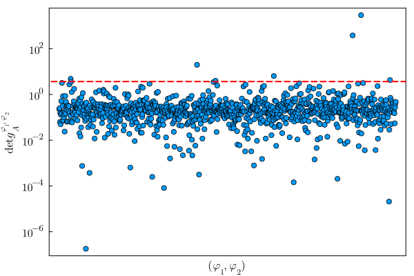
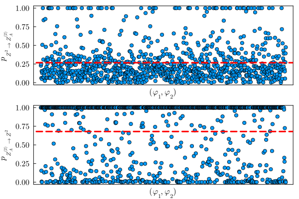

# plots-accessible-entanglement

## Bilayer Hubbard Model
EE results for $6\times 6 \times 2$ bilayer Hubbard model at half-filling, U=8, dashed lines represent the $t_{\perp}\rightarrow\infty$ limit for Renyi-2 and accessible entropies, respectively. The simulated temperature is at $\beta=16$ and the subsystem is partitioned as $6\times 6 \times 1$

Corresponding spin and charge distributions at different $t_{\perp}$. Spin distributions show parity effect in the AFM phase.

## Attractive Hubbard Model
### ED results for attractive Hubbard models at different fillings
1D at half-filling ($L=8, N_e=8$)

1D at non-half-filling ($L=8, N_e=6$)

2D at half-filling ($L=4\times 2, N_e=8$)

2D at non-half-filling ($L=4\times 2, N_e=6$)

### Swap Algorithm
QMC samples generated by Grover's algorithm, where the red dashed line indicates the average. Configurations with extreme values lead to a unphysical average. $\det g_A > 1 \Rightarrow S_2^{A} < 0$

QMC samples generated with the same random seed, but using swap algorithms. Rare configurations that have extreme values are suppressed when mapped to probabilities.
