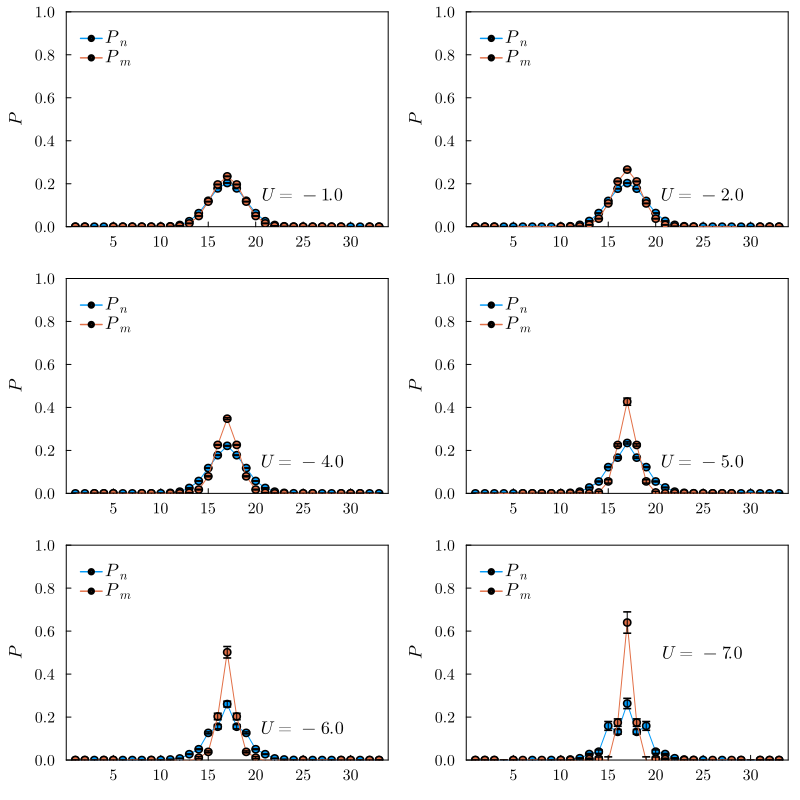
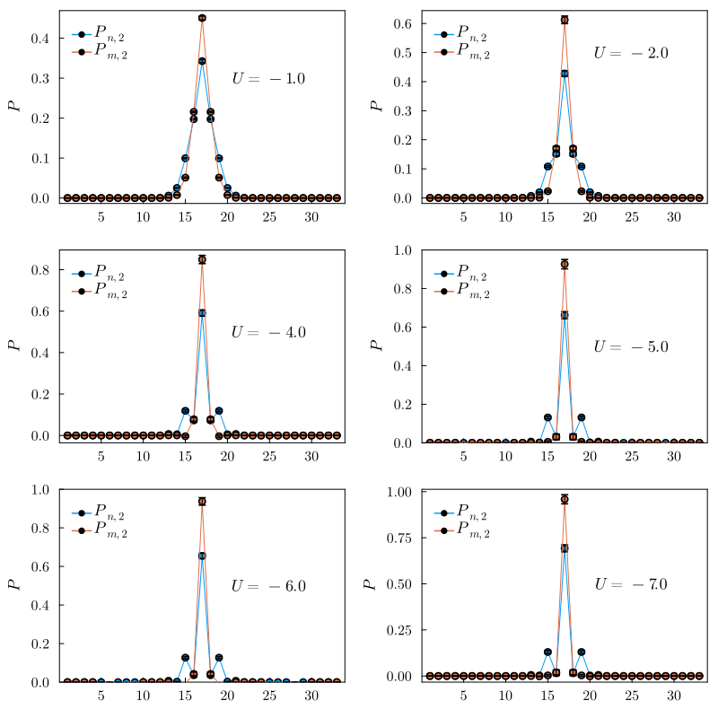
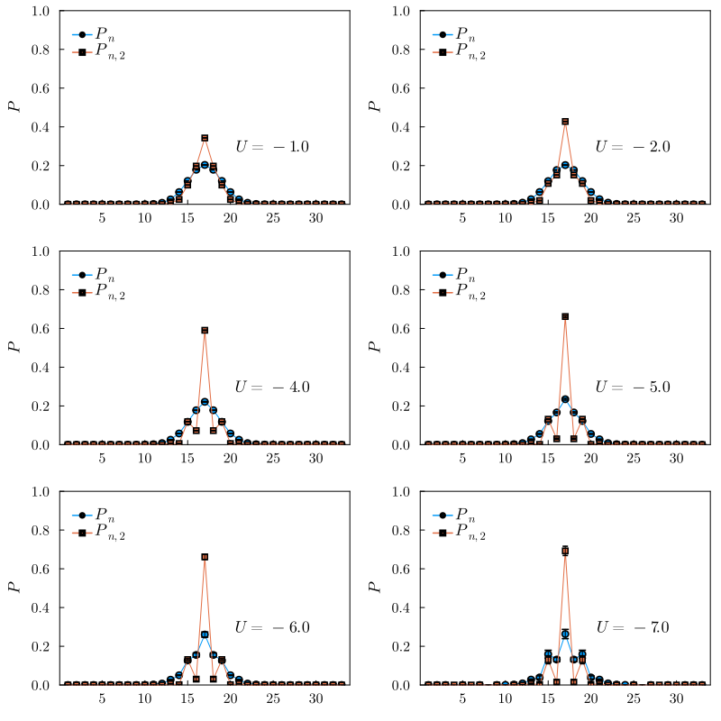
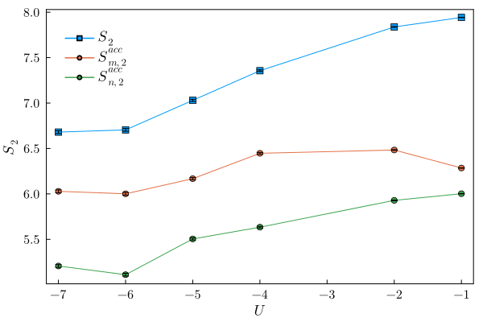
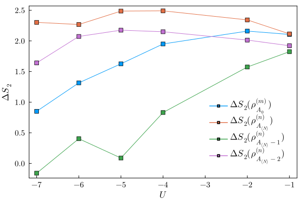

## Use spin HS transformation instead of the charge HS transformation

Consider a $U=-\infty$ simulation with a 2-site partition. A charge HS preserves the SU(2) symmetry so the up- and down- spin $P_n$ measurements are always the same and can only be either 
$$P_{n_\uparrow, \phi} = P_{n_\uparrow, \phi} = \begin{pmatrix} 0 \\ 1 \end{pmatrix}$$
or 
$$P_{n_\uparrow, \phi} = P_{n_\uparrow, \phi} = \begin{pmatrix} 1 \\ 0 \end{pmatrix},$$
so the total $P_n = P_{n_\uparrow, \phi} \cdot P_{n_\uparrow, \phi}^T$ is degenerate. If one uses the spin HS, $P_n$ values are complex and up- and down- spin are conjugate pairs: 
$$P_{n_\sigma, \phi} = \begin{pmatrix} a\pm bi \\ 0 \end{pmatrix}$$
or 
$$P_{n_\sigma, \phi} = \begin{pmatrix} 0 \\ a\pm bi \end{pmatrix}.$$ 
That allows the samples to fluctuate more and the average values have smaller variances.

## $P_n$ and $P_{n,2}$
The results are for $8\times 8$ Hubbard model at various $U$, the partition size is $8\times 2$

## $S_2(\rho_A)$ and $S_2(\rho_{A_n})$
We plot various EE measures, including the accessible EEs:

and the symmetry-resolved ones:
$$
S_2(\rho_{A_n}) = S_2 - \log\frac{P_{n,2}}{P^{2}_{n}}
$$
and define
$$
\Delta S_2(\rho_{A_n}) = \log\frac{P_{n,2}}{P^{2}_{n}}
$$
