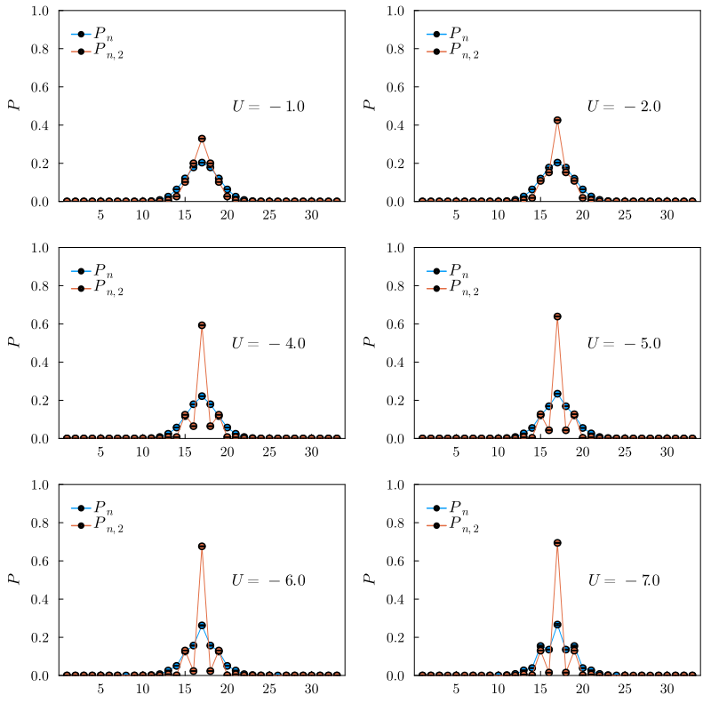
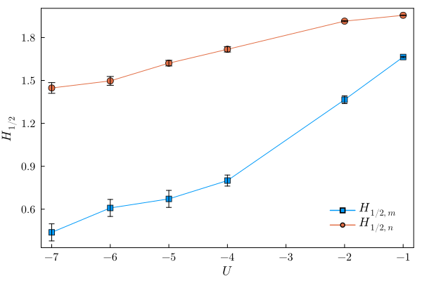
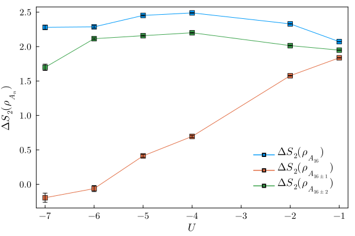
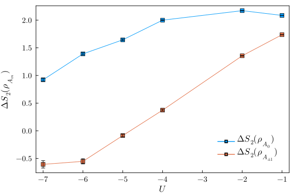

# Note 07/14/2023

All simulations are performed on $8\times 8$ Hubbard model at various $U$, the partition size is $8\times 2$. For all $P_n$ measurements, the number of averaged samples are $\sim 10^4$, and for all $P_{n,2}$ measurements, the number of averaged samples are $\sim 6\times10^4$

## Particle number distribution

## Shannon entropies
Regular Shannon entropy:

$$
H_1 = -\sum_n P_n \log P_n
$$

Renyi-generalized Shannon entropy:

$$
H_{1/2} = -2\sum_n \log (P_n)^{1/2}
$$

## Symmetry-resolve entropies

$$
\Delta S_2(\rho_{A_n}) = \log\frac{P_{n,2}}{P^{2}_{n}}
$$

### Charge sector

### Spin sector

