# Note 07/21/2023

All simulations are performed on $8\times 8$ Hubbard model at various $U$, the partition size is $8\times 4$.

## Partilce number distribution
$U=-1.0$

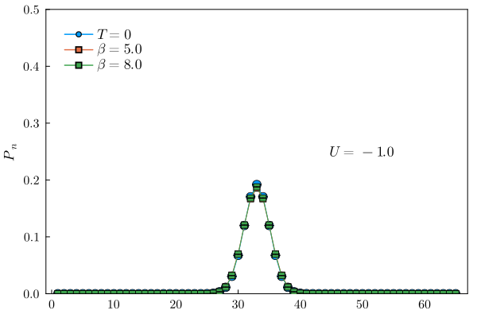

$U=-3.0$

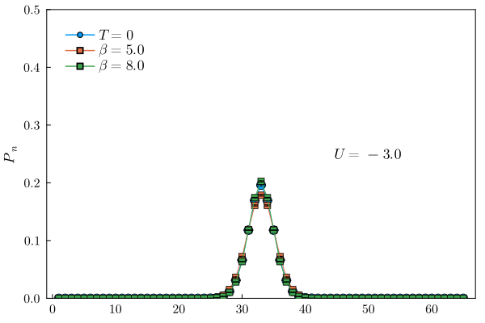

$U=-6.0$

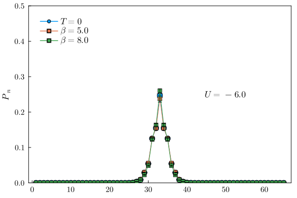

$U=-7.0$

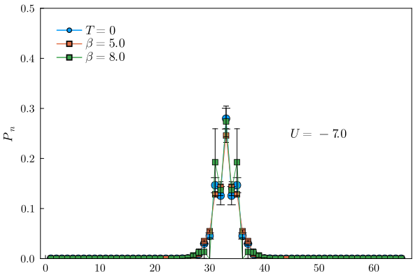

$U=-8.0$

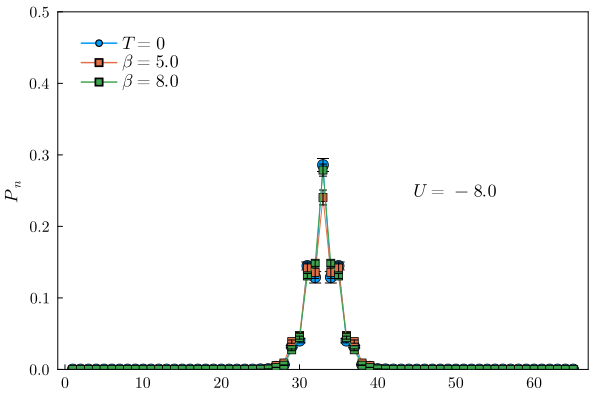

## Shannon entropies
$T=0$ Shannon Entropy

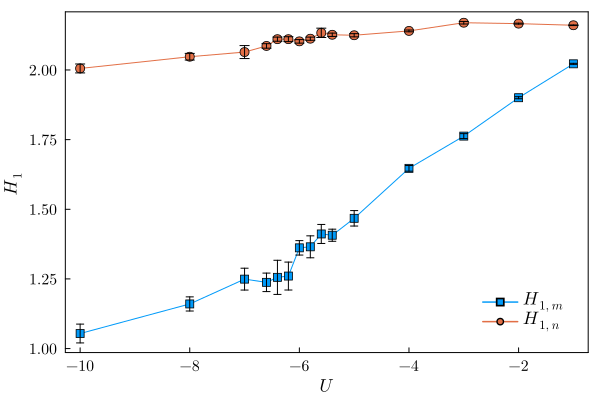

$\beta=5.0$ Shannon Entropy

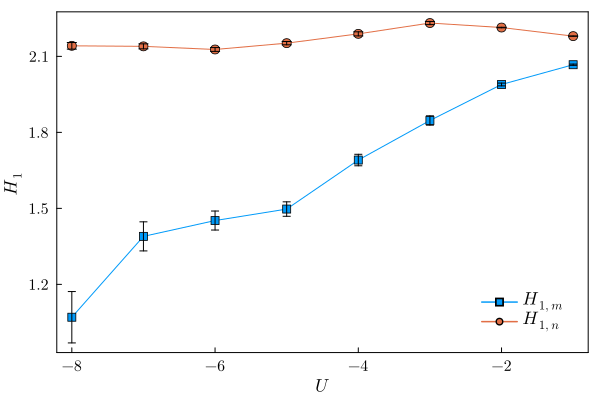

$\beta=8.0$ Shannon Entropy

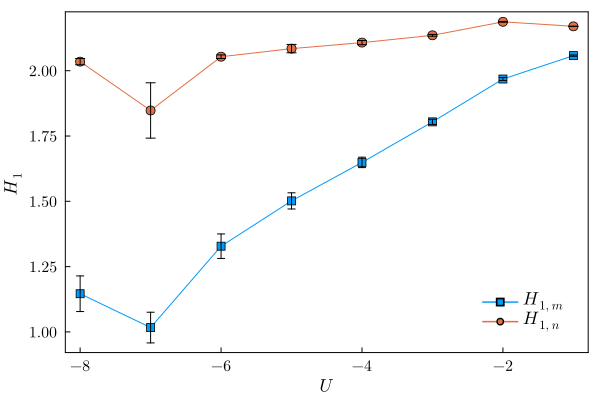

## Spin-spin correlation functions
$$
\langle S_{i+r} S_{i} \rangle
$$

$T=0$ Spin-spin correlation functions

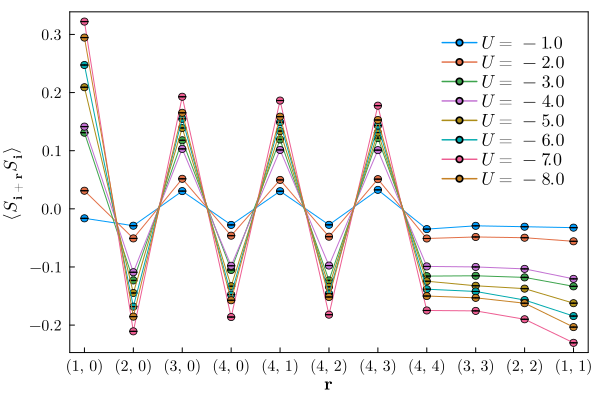

$\beta=5.0$ Spin-spin correlation functions

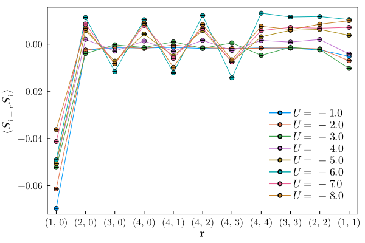

$\beta=8.0$ Spin-spin correlation functions

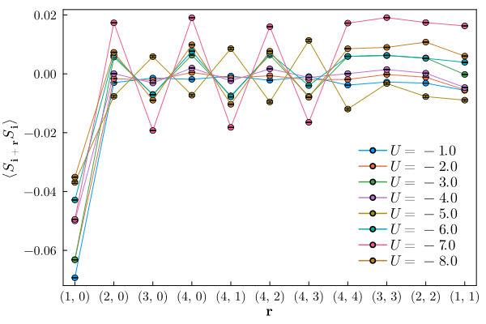