# Note 07/28/2023
$8\times8$ Attractive Hubbard model

## Correlation Functions at $T=0$
All quantities are measured at half-filling.

### Charge-charge correlation function
$$
\langle n_{i+r} n_{i} \rangle
$$

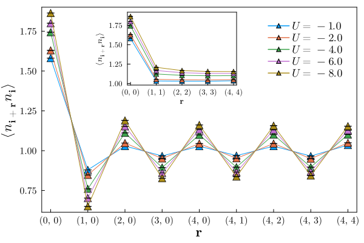

### Pair correlation functions
$$\langle n_{i+r,\sigma} n_{i,-\sigma} \rangle = \frac{1}{2}\langle n_{i+r,\uparrow} n_{i,\downarrow} + n_{i+r,\downarrow} n_{i,\uparrow}\rangle$$

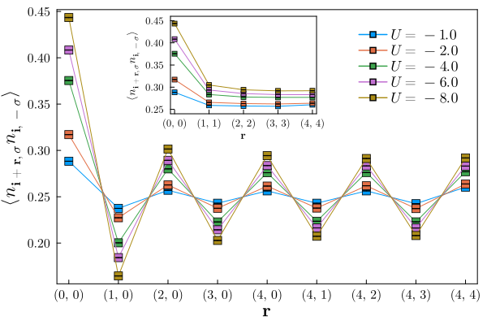

$$P_{\zeta}(i+r,i) = \sum_\sigma \langle c^{\dagger}_{i+r,\sigma}c^{\dagger}_{i+r,-\sigma} + c_{i,\sigma}c_{i,-\sigma}\rangle$$

## Structural Factors $T=0$

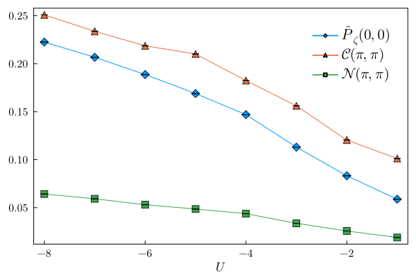

## Correlation Functions at $T>0$
### Pair correlation functions
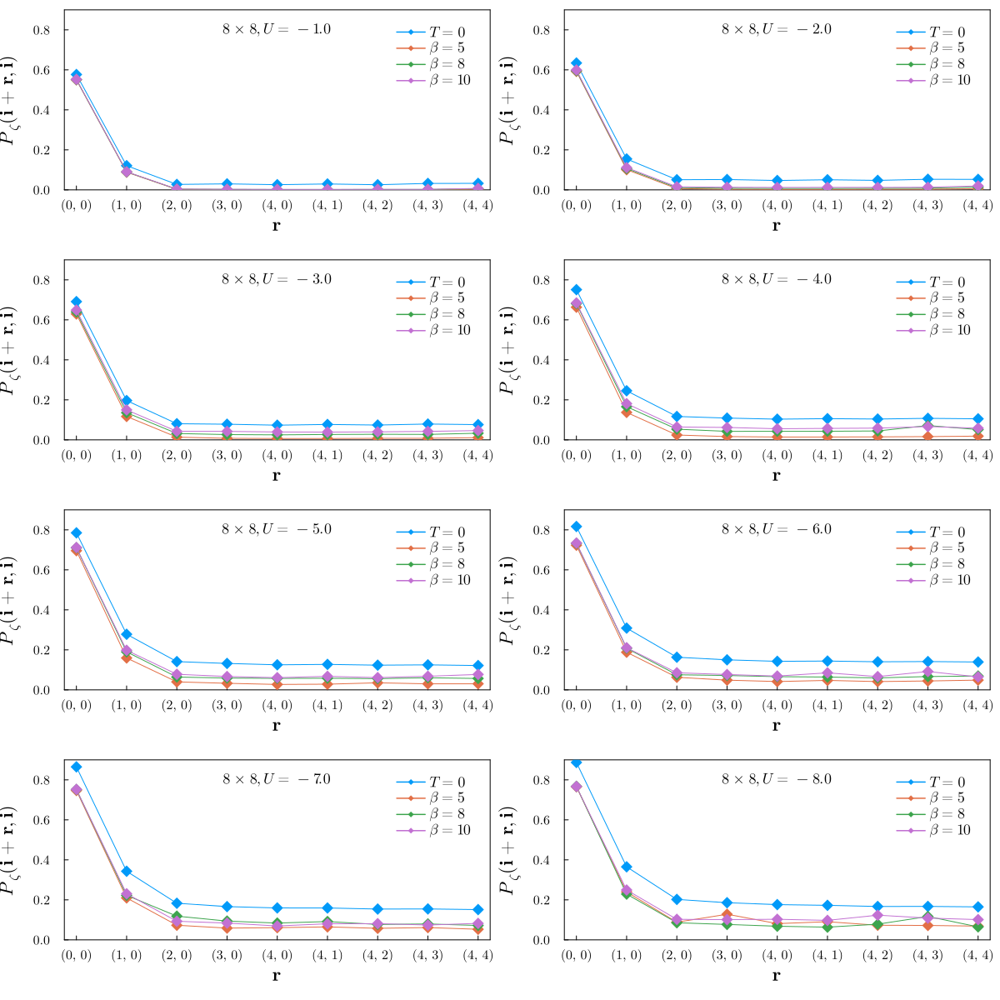

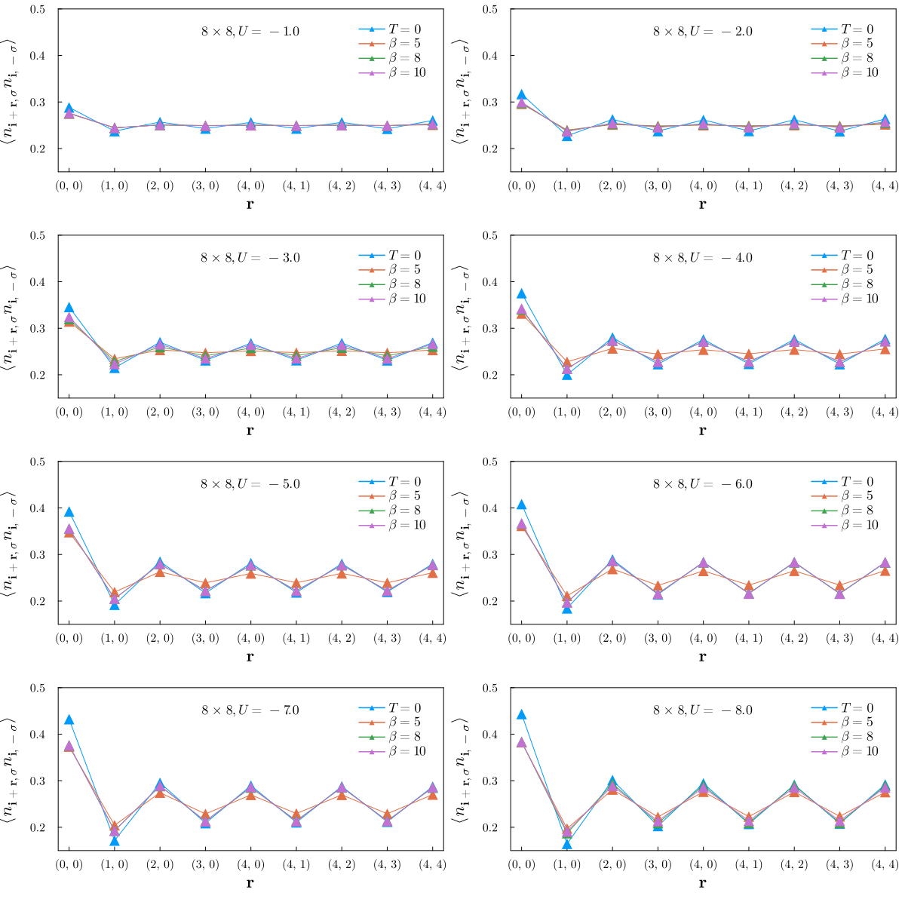

### Charge correlation functions
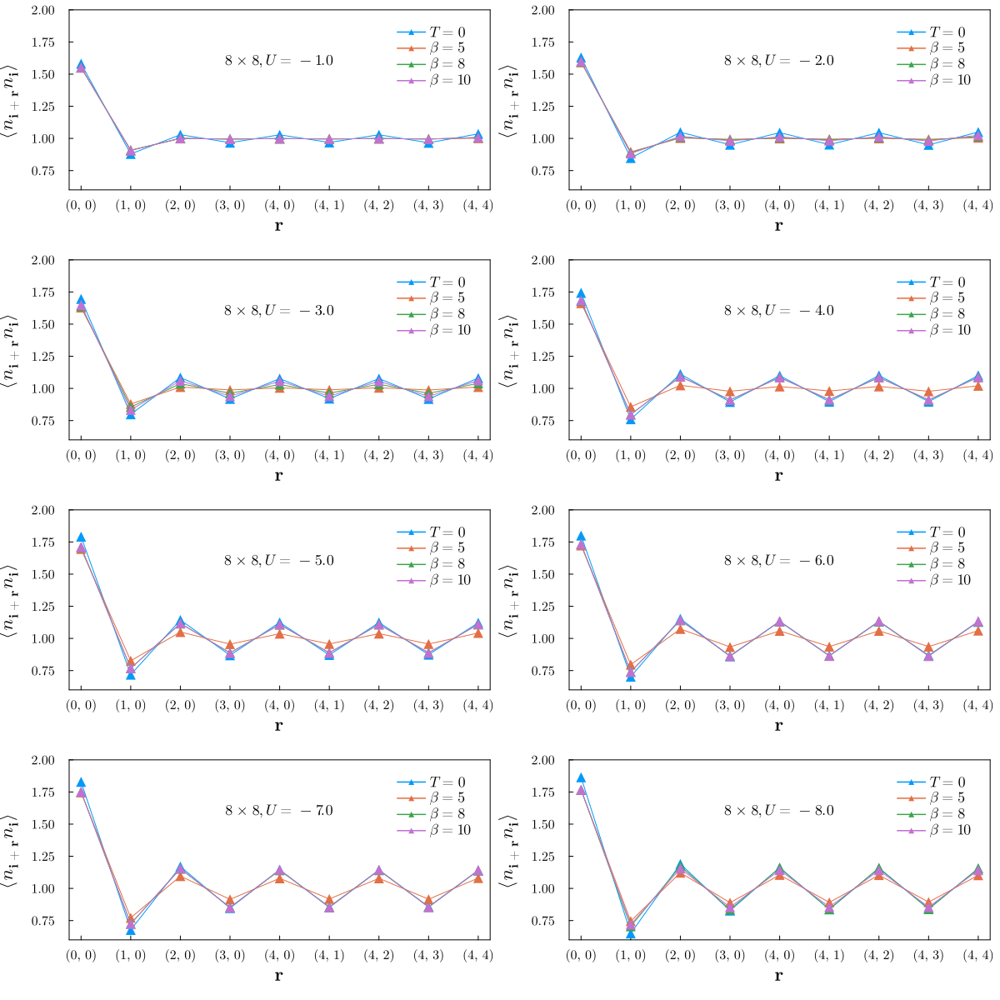

## Structural Factors $T>0$
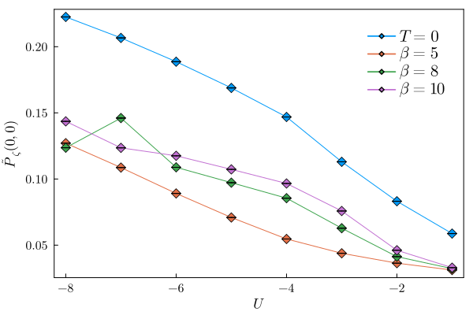

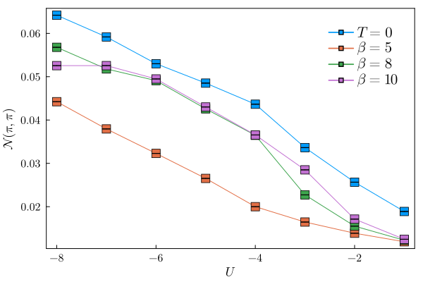

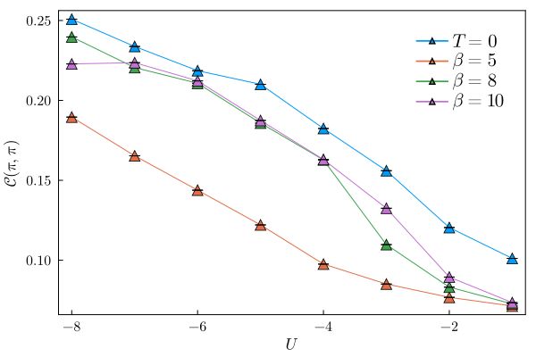

## Lower fillings are better-behaved
Samples are measured at finite-temperature ($\beta=8$) and $U=8$. The partition size is $8\times 4$.

### Quarter filling has fewer spikes
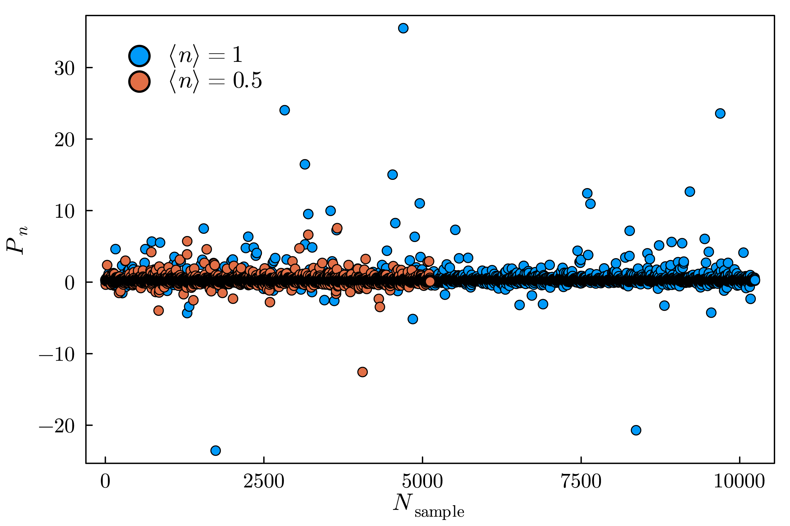

### Quarter filling has a more sound average
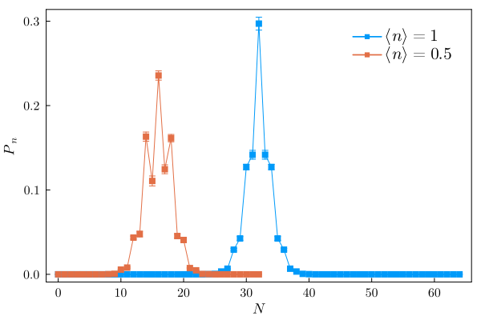